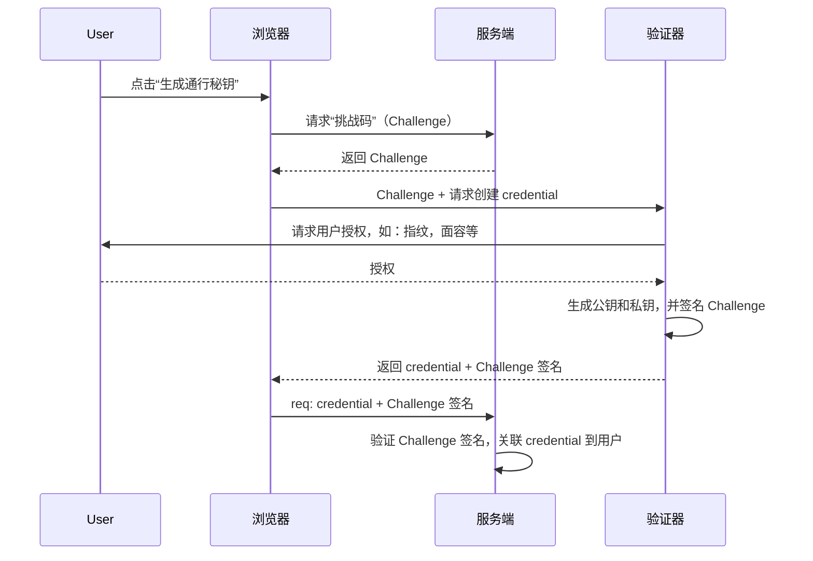
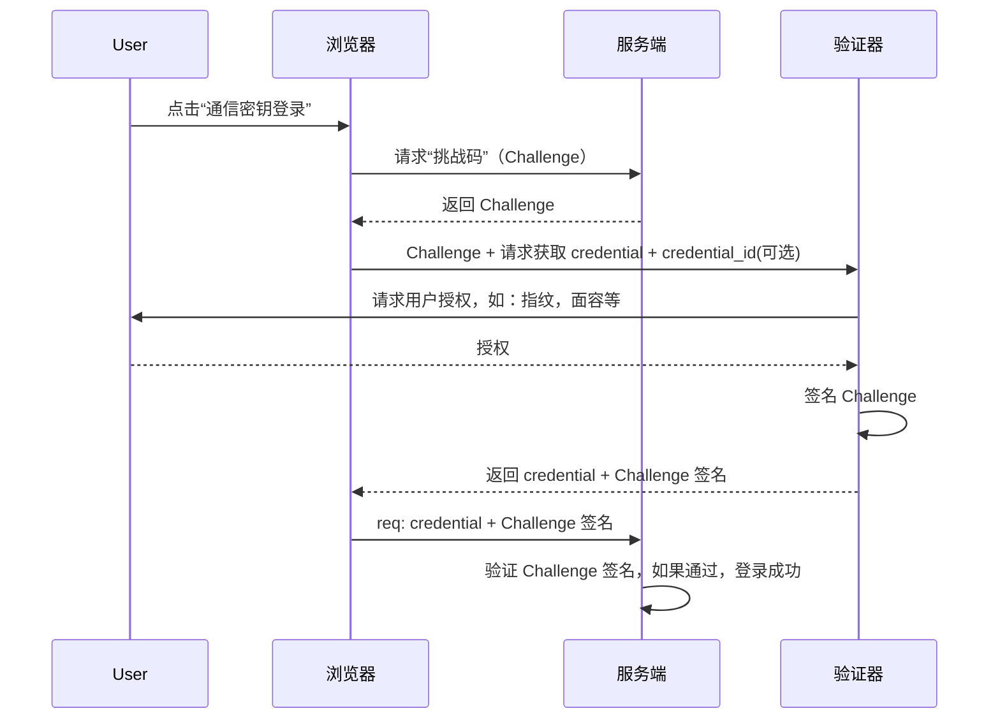
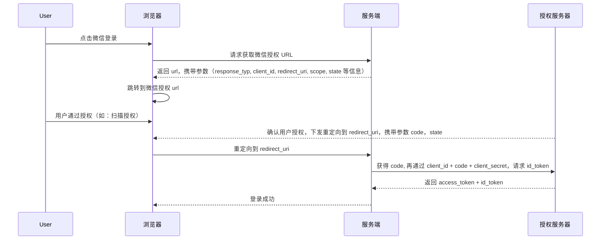

## JWT

JWT 全程是 JSON Web Token，它是一种紧凑的、自包含的、用于以 JSON 对象的格式在各方之间安全传输信息的标准。

### JWT 的结构

JWT 是一个字符串，有三个部分，以 “.” 分割：`Header.Payload.Signature`

- Header: 头部，声明算法（alg）和令牌类型（typ），Base64Url 编码
- Payload：数据载荷，存放实际信息（如 UserID，expires 等），Base64Url 编码
- Signature：签名，用 Header + Payload + 密钥 通过指定算法（如 HS256、RS256）计算出的签名

### 使用场景

典型的登录认证流程：

- 用户输入账号密码 -> 服务端验证通过
- 服务端生成 JWT（一般包含 userId, role, exp）
- 返回给前端，前端一般存储在 localstorage 中
- 在后续请求中，前端会在请求头中携带：Authorization: Bearer <jwt>
- 服务器会从请求头中获取 jwt，进行签名验证 + 是否过期 -> 通过则处理并返回数据

### 核心特点

|特点|说明|
|-|-|
|紧凑|字符串很短，方便在 URL、POST 参数、HTTP Header 中传输|
|自包含|负载里直接包含了用户信息，服务器不需要再去查数据库|
|无状态|服务端不再需要存储 session，便于水平扩展|
|防篡改|签名机制保证了 token 内容一旦被改动，验证就会失败|
|**非加密**|模式只是 Base64 编码，不是加密|

### 优点与缺点

优点

- 扩展性好：服务器集群无需共享 session 存储
- 跨平台：不依赖 Cookie，移动端、Web 端都很方便
- 性能高：验证 token 只需计算签名，无需查询数据库~

缺点

- 难以主动失效：一个 jwt 一旦签发了，在其失效时间之前始终有效。要”踢人下限“或者修改权限立即生效，需要额外的方案（如：“黑名单”）
- 数据量：负载不能太大，因为每次请求都会带上。
- 存储安全：客户端存储 jwt 需要小心 XSS（localstorage 风险） 和 CSRF（cookie 风险）

## WebAuthn

WebAuthn（Web Authentication API） 是现代 Web 标准中最重要的一项无密码（passwordless）身份认证技术。

### 核心组成

WebAuthn 核心原理是基于非对称加密技术，主要由三个部分组成：

- 用户代理（User Agent）：用户代理是指浏览器或者其他支持 WebAuthn 的客户端，它负责与用户进行交互，收集用户的身份认证信息，并将其发送给服务器
- 验证器（Authenticator）：身份验证器是指用于生成公钥和私钥的设备，如手机、USB 密钥或生物识别器
- 业务服务端（Relying Party）：Relying Party 是指需要进行身份认证的网站或应用程序，它负责生成挑战（Challenge）并将其发送给用户代理，然后验证用户代理发送的签名结果。

### 核心流程

1. 注册流程

首次为账户添加一个“通信密钥”或者“安全密钥”：

2. 认证流程（登录）

用户通过“通信密钥”进行登录

## OAuth

OAuth 是一个关于授权（Authorization）的开放标准。

### 核心角色

- 资源所有者（Resource Owner）：数据的拥有者，也就是用户本人
- 客户端（Client）：想要访问你的数据的第三方应用
- 授权服务器（Authorization Server）：负责验证你的身份并颁发访问令牌的服务器
- 资源服务器（Resource Server）：存放你数据的 API 服务器

### 四种授权类型

- 授权码模式（最推荐）
- 简化模式
- 密码模式
- 客户端模式

### 微信登录流程

